# Netflix — Software Architecture Design Document
**Version:** 1.0  
**Author:** Senior Staff Engineer / System Architect  
**Audience:** Engineering leadership, platform teams, SRE, security, DevOps  
**Status:** Production Blueprint  

> This document specifies a from-scratch, production-grade design of Netflix as it would be built today for 300M+ subscribers, tens of millions of concurrent streams, 99.99% availability, and global low-latency delivery. Everything is written from a build-it-today mindset: cloud-native, multi-region active/active, microservices on Kubernetes, event-driven with Kafka, ML-powered personalization, and a purpose-built CDN (Open Connect–style) for video delivery.

---

## Table of Contents

1. Product Requirements & Capacity Planning
2. High-Level Architecture
3. Detailed Component Design
4. Database Design
5. Video Streaming Pipeline
6. CDN Architecture
7. Recommendation System
8. Search System
9. Authentication
10. Streaming Architecture (Playback)
11. Real-Time Features
12. APIs
13. Message Queue Architecture (Kafka)
14. Caching
15. Storage
16. Security
17. Scalability
18. Reliability
19. DevOps
20. Cost Optimization
21. Sequence Diagrams
22. UML Diagrams
23. Data Flow Diagrams
24. Network Architecture
25. Technology Stack
26. Tradeoffs
27. 100 Netflix System Design Interview Questions with Answers
28. Final Architecture Diagram

---

# PART 1 — Product Requirements

## 1.1 Functional Requirements

- **Account & Identity**: sign up, sign in, MFA, social login (Google, Apple, Facebook), password reset, email verification, device management, up to 5 profiles per account (adult, kid).
- **Subscription & Billing**: plan selection (Basic, Standard, Premium, Ad-supported), trial, upgrade/downgrade, proration, coupons, gift cards, regional pricing, tax handling, invoicing, refunds, dunning.
- **Catalog**: browse home page, rows (Trending, Continue Watching, Because You Watched, New Releases, Top 10 in Country), title detail page, trailers, similar titles.
- **Search**: instant search, autocomplete, spell correction, filter by genre, language, cast, release year, maturity, sort by popularity, recency, relevance.
- **Playback**: play/pause/seek, adaptive bitrate streaming (HLS/DASH), multi-audio, multi-subtitle, quality selector, skip intro/recap, next episode auto-play, PIP, casting (Chromecast, AirPlay).
- **User State**: watch history, continue watching (per profile, per device), watchlist ("My List"), ratings (thumbs up/down/double-up), reviews (moderated).
- **Recommendations**: personalized home rows, ranking within row, cold-start onboarding, trending/regional/genre-based fallbacks.
- **Downloads**: offline downloads with DRM, expiry policy, download queue, storage quotas.
- **Notifications**: push (mobile), email, in-app for new releases, upcoming episodes, "leaving soon", price changes.
- **Parental Controls**: PIN-locked profiles, maturity rating filters, viewing activity, per-title restrictions.
- **Live Events**: live linear stream (sports, comedy specials), low-latency ABR, live DVR, chat.
- **Watch Together**: synchronized playback across accounts with in-session chat/reactions.
- **Admin/Studio Portal**: title ingest, metadata editing, artwork management, launch scheduling, rights windowing, encoding job management, A/B experiments.
- **Ads (AVOD tier)**: ad decisioning, SSAI (server-side ad insertion), frequency capping, brand-safety, measurement.

## 1.2 Non-Functional Requirements

| NFR | Target |
|---|---|
| Availability (control plane) | 99.99% (52.6 min/year downtime) |
| Availability (playback data plane) | 99.995% |
| Start-up latency (play click → first frame) | < 2s p95, < 1s p50 |
| Rebuffer ratio | < 0.4% of playtime |
| Search latency | < 100ms p95 end-to-end |
| Home page latency | < 400ms p95 |
| Recommendation staleness | < 24h for batch, < seconds for real-time signals |
| Global RPO / RTO | RPO ≤ 60s, RTO ≤ 5 min for regional failover |
| Zero-downtime deploys | Blue/green + canary, no user-visible impact |
| Regulatory | GDPR, CCPA, COPPA, PCI-DSS (payments), SOC2, DMCA |

## 1.3 Constraints

- Licensed content — cannot violate territorial rights windows (geo-restrict per title).
- ISP economics — must minimize inter-ISP transit costs (drives Open Connect / embedded CDN).
- Studio DRM mandates — Widevine L1/L3, FairPlay, PlayReady required by content licenses.
- Device fragmentation — 2000+ device types (SmartTVs, STBs, mobiles, browsers, consoles) with varying codec support (H.264, H.265, AV1, VP9).
- Regulatory data-residency (India, EU, Brazil, Korea) — user PII must be storable in-region.
- Payment method fragmentation across countries (UPI, iDEAL, PIX, Boleto, carrier billing, etc.).

## 1.4 Assumptions

- 300M paying members, ~600M profiles, ~1B registered devices.
- Peak Concurrency Ratio (PCR): ~30% of members stream during regional prime time.
- Average session length: 90 minutes.
- Average watch time per member per day: 2 hours.
- Average bitrate served: 5 Mbps (mix of SD, HD, 4K); 4K takes ~15 Mbps, SD ~1 Mbps.
- New titles/year: ~2,000 hours original + licensed catalog ~60,000 titles.
- Storage per hour of source: 500 GB mezzanine; delivered profiles multiply ~2–3×.

## 1.5 Success Metrics

- **Engagement**: hours viewed per member per week; % members playing daily (DAU/MAU).
- **Retention**: 30-day / 90-day retention; involuntary churn (payment fail) < 1.5%.
- **Quality of Experience (QoE)**: rebuffer ratio, video start failures (VSF), start-up delay, average bitrate, error rate.
- **Discovery**: CTR on recommendations, take rate (start-per-impression), depth of scroll.
- **Growth**: signup conversion, paid conversion after trial.
- **Reliability**: MTTR, MTBF, error budget consumption per service.

## 1.6 Capacity Planning (Back-of-envelope)

### Users
- **MAU**: 300M
- **DAU**: ~180M (60% of MAU stream on a given day)
- **Peak concurrent users (global)**: 300M × 30% peak × 0.4 (time-zone overlap) ≈ **36M concurrent**
- **Peak concurrent streams**: assume 1.2 streams/member concurrent (multi-profile) → **~45M concurrent streams**

### Bandwidth (egress)
- 45M × 5 Mbps average ≈ **225 Tbps peak egress**
- Daily egress: 180M × 2h × 5 Mbps × 3600 ≈ **~1.6 exabytes/day** (rough)
- ~95%+ of egress served from **Open Connect** (embedded/ISP-peered CDN), <5% from cloud origin.

### Storage
- Catalog: 60,000 titles × avg 100 min × avg 4 GB/hr (all rungs) ≈ **~40 PB** for delivery-ready assets.
- Mezzanine masters: 20,000 hours × 500 GB = **10 PB**; growing ~5 PB/year.
- With per-title AV1/HEVC/H.264 × ~8 rungs × HDR/SDR × per-shot encoding, delivered assets ≈ **50–100 PB** with 3× multi-region durability replication → **~300 PB effective**.

### Requests / Second
- Home page fetch: 180M DAU × 5 fetches/day / 86400 ≈ 10.4k RPS baseline, ~50k RPS peak.
- Playback manifest & license: 45M streams × (1 manifest + 1 license) initial + heartbeats every 30s → ~2M RPS heartbeats, 1.5M RPS steady RPCs.
- Search: 100M searches/day → ~1.2k RPS baseline, 10k RPS peak.
- Total API-tier RPS at peak: **~3–4M RPS**.
- Read/Write ratio across control-plane APIs: **~100:1** (browsing dominates; writes are watch progress, ratings, list edits).

### CDN
- Peak egress ~225 Tbps served from ~18,000 Open Connect appliances embedded at ISPs + regional POPs.
- Cache hit ratio target: **>95%** at edge, **>99%** including regional.

---

# PART 2 — High-Level Architecture

Netflix runs a **globally distributed, multi-region active-active** platform on top of a private CDN (Open Connect–style) plus a public-cloud (AWS-heavy) control plane. It is organized into four logical planes:

1. **Client Plane** — apps on TVs, mobile, web, consoles.
2. **Edge Plane** — DNS/GSLB, WAF, API Gateway, TLS termination, edge auth.
3. **Control Plane** — microservices for identity, catalog, subscription, personalization, admin.
4. **Data Plane (Video)** — encoding pipeline, packagers, DRM, Open Connect edge caches.

## 2.1 Client Apps

| Client | Stack | Notes |
|---|---|---|
| Web | React + TypeScript, Shaka Player | Widevine / PlayReady EME |
| iOS / tvOS | Swift, AVFoundation | FairPlay DRM |
| Android / Android TV | Kotlin, ExoPlayer | Widevine L1 |
| Smart TV (Tizen/WebOS/Roku/Fire TV) | Lightning/HTML5 or native SDKs | Vendor DRM |
| Game Console (PS/Xbox) | Native SDKs | PlayReady |

All clients speak to the platform via a **BFF (Backend-for-Frontend)** GraphQL/REST layer optimized per device class.

## 2.2 Backend Microservices

- **API Gateway / Edge Router** (Zuul-style, or Envoy/APISIX today): auth, rate limit, routing, request shaping.
- **Auth Service**: signup/login, tokens, MFA, OAuth, device registration.
- **User Service**: account root record.
- **Profile Service**: profiles under an account (kids/adult, avatar, maturity).
- **Subscription Service**: plans, entitlements.
- **Payment Service**: PCI-scoped, tokenized card storage via provider (Adyen/Stripe), billing runs.
- **Catalog / Video Metadata Service**: canonical title metadata, artwork, cast, seasons/episodes, rights windows.
- **Recommendation Service**: candidate generation + ranking; serves rows.
- **Search Service**: OpenSearch-backed, autocomplete, filters.
- **Watch History Service**: append-only viewing events store.
- **Continue Watching Service**: per-profile in-progress titles.
- **Watchlist / MyList Service**: profile-scoped list.
- **Streaming Service**: manifest generation, license issuance, CDN steering.
- **Notification Service**: push/email/in-app.
- **Analytics Service**: real-time + batch aggregation.
- **Admin Portal**: internal control panel for studio ops, marketing, PR.
- **Content Management**: title lifecycle, rights, artwork.
- **Content Upload**: mezzanine ingest.
- **Encoding Pipeline**: transcode, package, QC.
- **Ads Service** (AVOD tier).
- **Experimentation Service (A/B)**: feature flags, allocation.
- **Observability**: metrics (Prometheus/Atlas), logs (Fluent Bit → OpenSearch/S3), traces (OpenTelemetry → Jaeger/Tempo), alerting (Alertmanager, PagerDuty).

## 2.3 High-Level Diagram

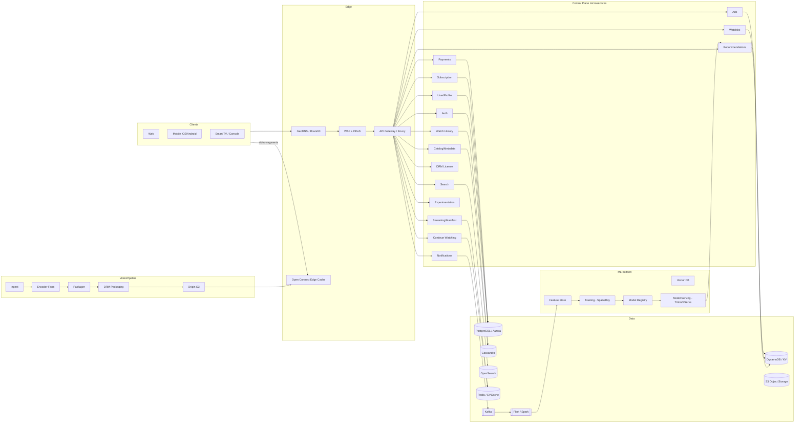

---

# PART 3 — Detailed Component Design

For each service: **Responsibilities, DB, Cache, MQ, Scaling, Failure Handling, APIs, Deployment, Dependencies.**

## 3.1 API Gateway / Edge Router

- **Responsibilities**: TLS termination, request routing to BFF/microservice, JWT validation, rate limiting, request/response transformation, canary routing, header enrichment (geo, device class), circuit breaker to backends.
- **DB**: none (config in etcd/Consul).
- **Cache**: local LRU for JWT public keys, route tables.
- **MQ**: emits access logs to Kafka (topic `edge.access`).
- **Scaling**: stateless, HPA on CPU + RPS; anycast IPs; sharded per region.
- **Failure Handling**: retries with jitter to healthy upstreams, circuit breaker (Hystrix-style), fallback to cached responses for GET catalog.
- **APIs**: all public HTTPS; internal gRPC/HTTP2 mesh.
- **Deployment**: Envoy on EKS with xDS control plane; blue/green.
- **Dependencies**: Auth (JWKS), Service Discovery (Consul/Kubernetes DNS), WAF.

## 3.2 Auth Service

- **Responsibilities**: signup, login, MFA, OAuth (Google/Apple/Facebook), token issuance (JWT + refresh), session/device management, password reset, email verify.
- **DB**: **PostgreSQL (Aurora)** — strongly consistent; users, credentials (bcrypt/argon2id), MFA seeds (encrypted in KMS), devices, sessions.
- **Cache**: Redis for refresh-token allowlist and rate limits (per-IP, per-account).
- **MQ**: Kafka topics `auth.signup`, `auth.login`, `auth.logout`, `auth.suspicious` for downstream fraud and notification.
- **Scaling**: read replicas per region; writes to primary in home region; token verification is purely stateless via JWKS at edge.
- **Failure Handling**: JWT verification degrades gracefully by trusting cached JWKS; login failures backoff; account lockout after N attempts.
- **APIs**: `POST /v1/signup`, `POST /v1/login`, `POST /v1/refresh`, `POST /v1/logout`, `POST /v1/mfa/verify`, `POST /v1/oauth/callback`, `POST /v1/reset/request`, `POST /v1/reset/confirm`.
- **Deployment**: EKS, PodDisruptionBudget, HPA on RPS, rolling.
- **Dependencies**: KMS, Email Service (SES), SMS gateway (Twilio), Fraud Service.

## 3.3 User Service

- **Responsibilities**: root account entity (email, country, plan pointer, language, primary phone).
- **DB**: PostgreSQL Aurora Global (cross-region reads).
- **Cache**: EVCache (Memcached fork) for account-by-id.
- **MQ**: emits `user.updated`.
- **Scaling**: read-heavy; multi-AZ Aurora with 15 read replicas per region.
- **Failure Handling**: stale reads from cache if DB unavailable (max 5 min stale).
- **APIs**: `GET/PUT /v1/users/{id}`.
- **Dependencies**: Auth, Subscription.

## 3.4 Profile Service

- **Responsibilities**: profiles under an account (max 5), avatar, language, maturity, kids flag, PIN.
- **DB**: PostgreSQL.
- **Cache**: Redis by accountId → profile list (TTL 10 min).
- **APIs**: `GET/POST/PUT/DELETE /v1/accounts/{id}/profiles`, `POST /v1/profiles/{id}/pin/verify`.
- **Scaling**: light; per-region replicas.
- **Dependencies**: User Service.

## 3.5 Subscription Service

- **Responsibilities**: plans (Basic/Standard/Premium/Ads), entitlements (max streams, HDR, 4K, downloads), state (active, past_due, canceled, paused), trial, coupons, dunning schedule.
- **DB**: PostgreSQL (financial-grade, ACID).
- **Cache**: Redis for entitlement lookup at playback (`sub:{userId}` → JSON).
- **MQ**: `sub.created`, `sub.updated`, `sub.canceled`, `sub.past_due` → Notifications, Analytics, Access Control.
- **Scaling**: reads served from cache; writes low volume.
- **Failure Handling**: if cache miss and DB down → fail-open to last known entitlement from JWT claim (short TTL).
- **APIs**: `POST /v1/subscriptions`, `PATCH /v1/subscriptions/{id}`, `POST /v1/subscriptions/{id}/cancel`, `GET /v1/entitlements/{userId}`.

## 3.6 Payment Service

- **Responsibilities**: tokenized payment methods, charge, refund, tax (via Vertex/Avalara), fraud (Sift), 3DS, dunning.
- **DB**: PostgreSQL (PCI-DSS scoped VPC), encrypted columns via KMS/HSM.
- **Cache**: none for payment data; Redis for idempotency keys.
- **MQ**: `payment.succeeded`, `payment.failed`, `payment.refunded`.
- **Failure Handling**: idempotent charge with idempotency-key TTL 24h; outbox pattern → Kafka; DLQ on webhook parse failures.
- **APIs**: `POST /v1/payments`, `POST /v1/payments/{id}/refund`, `POST /v1/webhooks/{provider}` (Stripe/Adyen).
- **Dependencies**: External PSPs, Subscription, Fraud, Tax.

## 3.7 Catalog / Video Metadata Service

- **Responsibilities**: canonical title, seasons, episodes, artwork variants, trailers, cast/crew, maturity, availability windows, languages, subtitles, per-country availability matrix.
- **DB**: **Cassandra** for global multi-region reads (eventual consistency OK; content changes infrequently). Master editorial data in PostgreSQL with CDC → Cassandra.
- **Cache**: EVCache warmed globally on new title publish; CDN caches title JSON with 5-min TTL and stale-while-revalidate.
- **MQ**: `catalog.published`, `catalog.updated` fanned out to Search indexer, CDN purge, Recommendations feature refresh.
- **Scaling**: massively read-heavy; content read from edge cache >99% of the time.
- **APIs**: `GET /v1/titles/{id}`, `GET /v1/titles/{id}/episodes`, `GET /v1/rows/home`, `GET /v1/genres/{id}/titles`.

## 3.8 Search Service

- **Responsibilities**: full-text, autocomplete, spell correction, filters, personalized re-ranking.
- **DB / Index**: **OpenSearch** cluster (multi-region), 30 shards, 2 replicas; edge nodes with n-gram autocomplete index.
- **Cache**: Redis for top-1000 queries (24h TTL).
- **MQ**: consumes `catalog.*` events to update indices; near-real-time indexing via bulk API.
- **Scaling**: shard by title-id hash; autocomplete separate lightweight index.
- **APIs**: `GET /v1/search?q=&filters=&page=`, `GET /v1/search/suggest?q=`.
- **Failure Handling**: fallback to cached top queries; graceful degradation (no personalization if ranker down).

## 3.9 Recommendation Service

- **Responsibilities**: home page rows per profile, similar titles, trending, cold-start.
- **DB**: **DynamoDB / Cassandra** for precomputed rows keyed by `profileId#rowType#date`; **Vector DB** (Milvus/Pinecone/OpenSearch-KNN) for embeddings.
- **Cache**: Redis for `home:{profileId}` 15-min TTL; per-request memoization.
- **MQ**: consumes `play.event`, `rating`, `search.event`, `impression` from Kafka into Flink jobs updating features.
- **Scaling**: reads served from cache/DDB; real-time re-ranking done on GPU model servers (Triton) with autoscaling.
- **Failure Handling**: three tiers — (1) live model, (2) cached ranked rows, (3) editorial/trending fallback per country.

## 3.10 Watch History Service

- **Responsibilities**: append-only viewing events, aggregates for "seen it", per-title watch progress.
- **DB**: **Cassandra** partitioned by `profileId` — write-heavy, time-series.
- **Cache**: EVCache for hot profile summaries.
- **MQ**: consumes heartbeats from `playback.heartbeat` topic (every 30s), writes to Cassandra in batched form.
- **Scaling**: writes ~2M/s peak; Cassandra sized for 5M writes/s across a region.
- **APIs**: `GET /v1/history/{profileId}`, internal `POST /v1/history/events` (via Kafka).

## 3.11 Continue Watching Service

- **Responsibilities**: for each profile: last playback position per title, sorted by recency, filtered to non-completed.
- **DB**: Redis primary (sorted set per profile) + DynamoDB durable copy.
- **MQ**: subscribes to `playback.heartbeat`.
- **APIs**: `GET /v1/continue/{profileId}`, `DELETE /v1/continue/{profileId}/{titleId}`.

## 3.12 Watchlist (MyList)

- **DB**: DynamoDB `pk=profileId, sk=addedAt#titleId`.
- **Cache**: Redis list, TTL 1h.
- **APIs**: `GET/POST/DELETE /v1/mylist/{profileId}`.

## 3.13 Streaming Service (Manifest & Steering)

- **Responsibilities**: build per-session HLS/DASH manifest with permitted bitrates (based on plan + device), select best CDN via steering, issue session token, integrate with DRM license service, log QoE.
- **DB**: DynamoDB for session state; per-title asset map in S3 (immutable).
- **Cache**: Redis for CDN health, ISP → cache mapping.
- **MQ**: publishes `stream.started`, `stream.ended`, QoE metrics to Kafka.
- **Scaling**: stateless, HPA to millions of QPS.
- **APIs**: `POST /v1/play/{titleId}` → returns manifest URL, license URL, session token, chosen CDN.

## 3.14 DRM License Service

- **Responsibilities**: issue Widevine/FairPlay/PlayReady licenses; validate entitlement and device.
- **DB**: DynamoDB for license grants; KMS/HSM-backed key hierarchy.
- **Cache**: none for licenses.
- **Scaling**: regional deployments with warm HSMs; anycast.

## 3.15 Notification Service

- **Responsibilities**: push (APNs/FCM), email (SES), in-app; user preference respected.
- **DB**: DynamoDB for delivery log.
- **MQ**: consumer of many topics; publisher for delivery receipts.
- **Scaling**: horizontal consumer groups; DLQ per channel.

## 3.16 Analytics

- **Responsibilities**: real-time (Flink) dashboards for playback QoE; batch (Spark on S3+Iceberg) for BI, ML features.
- **Storage**: S3 + Apache Iceberg tables; Snowflake / Druid for BI OLAP.
- **Deployment**: Kafka → Flink → Iceberg; Spark on Kubernetes.

## 3.17 Admin Portal / Content Management / Content Upload / Encoding

Detailed in Part 5.

## 3.18 Observability Stack

- Metrics: **Prometheus** + Netflix Atlas-style long-term store.
- Logs: **Fluent Bit → Kafka → OpenSearch/S3**.
- Traces: **OpenTelemetry → Tempo/Jaeger**.
- Alerting: **Alertmanager + PagerDuty**.
- Dashboards: **Grafana**.
- Chaos: **Chaos Monkey / Gremlin**.

---

# PART 4 — Database Design

## 4.1 Polyglot Persistence

| Store | Purpose | Why |
|---|---|---|
| PostgreSQL (Aurora Global) | Users, Auth, Subscriptions, Payments, Editorial catalog master | Strong ACID, relational integrity, financial correctness |
| Cassandra | Watch History, Global Catalog replica, per-region time-series | Multi-region masterless writes, horizontal scale, tunable consistency |
| DynamoDB | Sessions, Watchlist, Recommendation rows, Continue Watching durable | Managed, single-digit ms KV at scale |
| Redis / EVCache | Hot cache, sessions, counters, rate limits | Sub-ms latency |
| OpenSearch | Search, logs | Full-text + analytics |
| S3 + Iceberg | Data lake, video assets, backups | Cheap, durable, 11 nines |
| Vector DB (Milvus/OpenSearch-KNN) | Embeddings for recs & semantic search | ANN at scale |
| ClickHouse / Druid | Real-time analytics OLAP | Sub-second aggregations |

## 4.2 ER Diagram (Core)

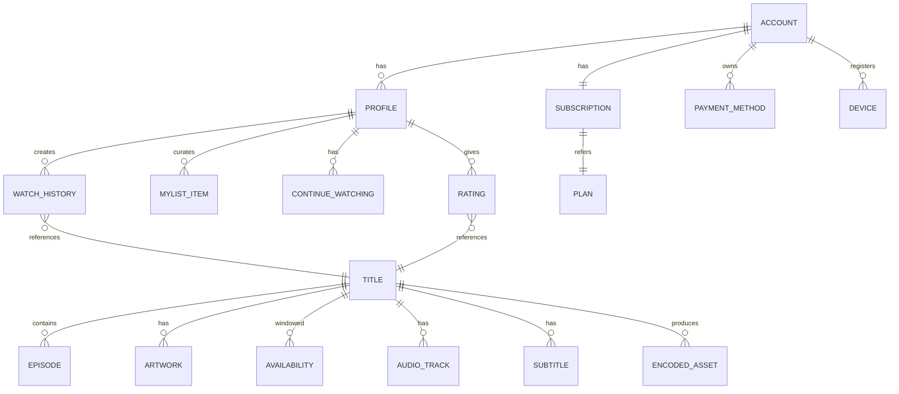

## 4.3 Key Tables (Schemas)

### PostgreSQL: accounts
```sql
CREATE TABLE accounts (
  id           UUID PRIMARY KEY DEFAULT gen_random_uuid(),
  email        CITEXT UNIQUE NOT NULL,
  password_hash TEXT NOT NULL, -- argon2id
  country      CHAR(2) NOT NULL,
  status       TEXT NOT NULL, -- active|suspended|deleted
  created_at   TIMESTAMPTZ NOT NULL DEFAULT now(),
  updated_at   TIMESTAMPTZ NOT NULL DEFAULT now()
);
CREATE INDEX accounts_country_idx ON accounts(country);
```

### PostgreSQL: subscriptions
```sql
CREATE TABLE subscriptions (
  id            UUID PRIMARY KEY,
  account_id    UUID NOT NULL REFERENCES accounts(id),
  plan_id       TEXT NOT NULL,
  status        TEXT NOT NULL, -- trial|active|past_due|canceled|paused
  current_period_start TIMESTAMPTZ,
  current_period_end   TIMESTAMPTZ,
  cancel_at     TIMESTAMPTZ,
  created_at    TIMESTAMPTZ NOT NULL DEFAULT now()
);
CREATE UNIQUE INDEX sub_active_per_account ON subscriptions(account_id) WHERE status IN ('trial','active','past_due');
```

### Cassandra: watch_history
```
CREATE TABLE watch_history (
  profile_id uuid,
  bucket     text,        -- e.g. yyyy-mm
  event_ts   timestamp,
  title_id   uuid,
  episode_id uuid,
  position_ms bigint,
  duration_ms bigint,
  device_id  uuid,
  PRIMARY KEY ((profile_id, bucket), event_ts, title_id)
) WITH CLUSTERING ORDER BY (event_ts DESC);
```
Partition key `(profile_id, bucket)` keeps partitions bounded (~one month per partition).

### DynamoDB: continue_watching
- `PK = profileId`, `SK = titleId`
- Attributes: `position_ms`, `updated_at`, `episode_id`
- GSI on `updated_at DESC` for "most recently watched" queries.

### DynamoDB: mylist
- `PK = profileId`, `SK = added_at#titleId`

### OpenSearch: titles
- Fields: title, synonyms, cast[], directors[], genres[], languages[], year, popularity, embeddings (dense_vector 512).
- Autocomplete: edge n-gram analyzer on title/cast.

### Vector DB: user & title embeddings
- 128-dim for candidate generation; 512-dim for ranking features.

## 4.4 Partitioning, Sharding, Replication

- **Aurora Global**: primary region with 5 secondaries; sub-second cross-region replication.
- **Cassandra**: NetworkTopologyStrategy, RF=3 per region, 3+ regions; `LOCAL_QUORUM` reads/writes.
- **DynamoDB**: Global Tables; on-demand + provisioned autoscaling.
- **OpenSearch**: 30 primary shards for `titles`, 2 replicas; index rollover monthly for logs.
- **Redis**: Cluster mode, 16384 slots, replica per master, cross-AZ.

## 4.5 SQL vs NoSQL — Rationale
- **SQL** for correctness-critical, relational, low-volume domains (payments, subscriptions, auth).
- **NoSQL** for high-volume, denormalized, per-user access patterns (history, recs, sessions).
- **Search & Analytics** in purpose-built engines (OpenSearch, ClickHouse).
- **Video assets** in object storage — never in a DB.

---

# PART 5 — Video Streaming Pipeline

## 5.1 Ingest / Upload

- Studios/partners upload mezzanine (ProRes/JPEG2000/IMF) via **signed S3 multi-part upload** with resumable chunks (aspera/S3 accelerate for large files).
- Ingest worker validates manifest (IMF CPL), checksum (MD5/xxHash), and metadata; on success emits `ingest.completed`.

## 5.2 Storage

- **S3 Standard** for mezzanine.
- **S3 Intelligent-Tiering** for delivered rungs (auto move to IA/Glacier per popularity).
- Multi-region replication for tier-1 catalog.

## 5.3 Encoding / Transcoding

- **Per-title / per-shot encoding**: analyze content complexity to compute optimal bitrate ladder (Netflix's dynamic optimizer).
- Codecs: **AV1** (long-tail, mobile), **HEVC/H.265** (4K HDR), **H.264** (compatibility), **VP9** for legacy Android.
- Rung set typical (H.264): 235, 375, 560, 750, 1050, 1750, 2350, 3000, 4300, 5800 kbps; 1080p rungs; 4K HEVC/AV1 rungs at 8/12/16 Mbps HDR10/DV.
- **Encoder farm** on Kubernetes with GPU nodes + spot instances; job orchestrator (Argo/Temporal) breaks title into **shots**, encodes in parallel, reassembles.

## 5.4 Packaging & DRM

- **Shaka Packager** produces fMP4 CMAF segments (2–6s) with a single ISO/BMFF container packaged as HLS *and* DASH via **CMAF**.
- Common Encryption (**CENC**) with multi-key DRM: Widevine, FairPlay, PlayReady all keyed off the same content keys.

## 5.5 Subtitles, Audio, Thumbnails, Previews

- Subtitles: WebVTT + TTML; auto-generated via ASR pipeline (Whisper-class), reviewed by humans for premium originals.
- Multi-language dubs: separate audio tracks in the CMAF adaptation set.
- Thumbnails: sprite sheets (BIF) generated for scrubber; storyboard extracted at 10s intervals.
- Trick-play preview: short low-bitrate scroll preview.

## 5.6 QC & Publish

- Automated QC (VMAF, PSNR, loudness EBU R128, black-frame detection).
- Manual spot check for originals.
- Publish flow flips availability windows, purges CDN staging, pre-warms edge caches for scheduled launches.

## 5.7 CDN Distribution (Open Connect)

- Assets pushed from origin S3 to **Open Connect Appliances (OCAs)** during off-peak hours via **fill windows**.
- OCAs are 1U/2U/4U servers with 100+ TB NVMe, placed:
  - **Embedded** inside ISP networks (majority of egress).
  - **Peered** at major IXPs.
- Manifest URLs hostname-rewritten to nearest healthy OCA.

## 5.8 Streaming/Playback Flow

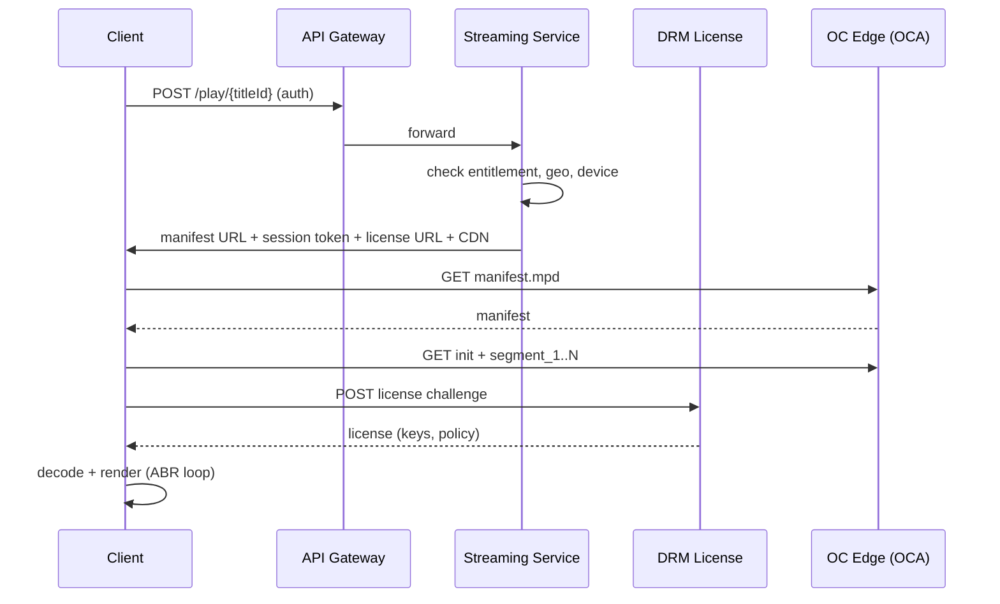

---

# PART 6 — CDN Architecture

## 6.1 Tiers

1. **Global Origin (S3, multi-region)** — canonical assets.
2. **Regional Cache Tier (Tier-2)** — fills OCAs; sits in cloud regions.
3. **Edge OCAs** — deep inside ISPs, closest to eyeball.

## 6.2 Steering & Routing

- Client requests **CDN steering** endpoint → returns ranked list of OCAs based on client IP → ISP → OCA mapping (BGP-derived), OCA health, cache fullness, current utilization.
- If preferred OCA saturates (>85% NIC), steer to next; if all peered OCAs busy, fall back to peering exchange / cloud CDN (CloudFront/Fastly) for overflow.

## 6.3 Caching Strategy

- Immutable segment URLs (`/v/{titleId}/{profile}/{seg}.m4s`) → infinite TTL.
- Manifests: short TTL (5–30s live, 5m VOD).
- **Fill windows**: predictive pre-positioning of new releases at 3am local per OCA using popularity forecast + region.
- LRU with size-aware and popularity-weighted eviction.

## 6.4 Cache Invalidation

- Content generally immutable; if error requires purge, control plane issues **key-purge** via secure fanout across OCAs (versioned URLs mostly avoid purges).

## 6.5 Failover

- If an OCA fails, steering excludes it within 10s (health via heartbeats).
- Regional cloud CDN acts as safety net for cold titles.
- Multi-CDN active-active with real-time QoE-based weighting.

## 6.6 Bandwidth Optimization

- AV1 saves ~30–50% vs H.264 at same quality.
- Per-title encoding cuts bitrate 15–30%.
- Client-side ABR uses BOLA/DASH.js-style algorithms.
- HTTP/2 + TLS 1.3 + 0-RTT; QUIC (HTTP/3) rollout for mobile.

---

# PART 7 — Recommendation System

## 7.1 Architecture

Two-stage retrieve-and-rank:

1. **Candidate Generation** — reduce catalog (~60k) → ~1000 titles per profile per row.
   - ANN over user embedding against title embeddings (Milvus).
   - Co-view collaborative filtering (ALS).
   - Genre/actor affinity.
   - Trending, editorial, regional.
2. **Ranking** — deep model (Two-Tower + DNN / Transformer) scores candidates with hundreds of features (user, item, context, session).

Then **row assembly** picks diverse rows (MMR) and orders rows by likely engagement.

## 7.2 ML Pipeline

- **Data Sources**: playback events, impressions, ratings, search queries, device, time-of-day.
- **Feature Store**: **Feast** or in-house; online (Redis/DDB) + offline (Iceberg on S3).
- **Training**: nightly batch on Spark+Ray; incremental fine-tuning hourly for trending; A/B tested via experimentation platform.
- **Model Registry**: MLflow.
- **Serving**: **Triton / KServe** on GPU nodes; latency budget 40ms p95.
- **Vector DB**: Milvus or OpenSearch KNN; IVF-PQ index for 10^8 vectors.

## 7.3 Real-Time Signals

- Flink jobs on Kafka `play.event` update session features (last 10 titles, dwell, skip) with <10s lag.
- Online ranker fetches session features per request.

## 7.4 Cold Start

- **New user**: onboarding taste survey → seed embedding via item-embedding centroid; heavy fallback to trending-in-country and editorial rows.
- **New title**: content-based embedding from metadata + trailer video/audio embeddings (CLIP-style); boosted for exploration.

## 7.5 Data Flow

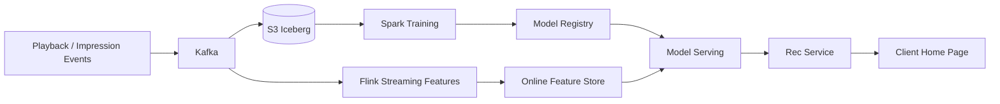

---

# PART 8 — Search System

## 8.1 Components

- **Ingest**: catalog events → indexer → OpenSearch bulk API.
- **Autocomplete**: separate `titles_suggest` index with edge n-gram + completion suggester; served by dedicated low-latency cluster.
- **Query**: multi-field BM25 + function_score with popularity boost + personalization re-rank (LTR model).
- **Spell correction**: OpenSearch `phrase suggester` + custom Levenshtein on top queries.
- **Filters**: genre, language, cast, year, maturity — implemented as filter contexts (no scoring impact).

## 8.2 Ranking

- Base: BM25.
- Boosts: popularity (global + country), recency, availability, personalization (dot product user⋅title embedding).
- Learning-to-rank (LambdaMART) trained on click/play labels.

## 8.3 Caching

- Redis for top-1000 queries per country; TTL 24h; invalidated by catalog change events.

## 8.4 Indexes

- `titles`: 30 shards × 2 replicas.
- `titles_suggest`: 6 shards × 3 replicas (autocomplete hot).
- `people`: cast/directors for entity search.
- Alias-based blue/green reindex.

---

# PART 9 — Authentication

## 9.1 Signup / Login

- Password hashed with **argon2id** (m=64MB, t=3).
- Email verification via signed token (JWS) with 24h TTL.
- Optional MFA (TOTP or SMS).
- Rate limits per IP + per account.

## 9.2 Tokens

- **Access token**: short-lived JWT (15 min) signed by regional signer with rotating keys (JWKS).
- **Refresh token**: opaque, 30-day, stored in Redis + DDB with device binding; rotation on each use; reuse detection revokes family.
- OAuth2 authorization-code + PKCE for third-party.

## 9.3 Sessions & Devices

- Device fingerprint (DRM device ID + user-agent hash).
- Concurrent stream limit enforced at session creation via atomic counter in Redis; violates → deny + prompt.
- Device management UI to view/logout individual devices.

## 9.4 Password Reset

- Email link with signed single-use token (JWS), 30-min TTL.
- On reset, invalidate all refresh tokens.

## 9.5 Multi-Device / Concurrent Streams

- Redis counter per subscription: `streams:{subId}` → INCR/DECR on session start/heartbeat/end; TTL to auto-clean crashes.

---

# PART 10 — Streaming Architecture (Playback)

## 10.1 Player Responsibilities

- Fetch manifest, parse periods/adaptation sets/representations.
- ABR algorithm (buffer-based BOLA + throughput heuristics).
- Segment fetch via HTTP/2/QUIC with pipelining.
- Decrypt via EME/CDM; render via MSE (web) / native (mobile/TV).
- Report QoE metrics every 30s (`playback.heartbeat`).
- Persist local playback state for offline resume.

## 10.2 Buffering

- Startup: fill 2–4s target before play.
- Steady: 30–60s buffer; upshift when buffer > threshold & throughput sustained.
- Downshift: aggressive on 2 consecutive stall risk signals.

## 10.3 CDN Selection

- Steering service returns primary + backup CDNs.
- Player runs periodic probes; if avg download time / segment duration > 0.8 for N segments → switch.

## 10.4 Offline Downloads

- Mobile only; DRM license issued with **offline persistence** flag + expiry (up to 30 days or 48h after first play).
- Encoded as smaller AV1 rungs to save disk.
- Downloaded via same OCA URLs.
- Renewal requires online periodic license check.

## 10.5 Continue Watching / Resume

- Client posts heartbeats with `position_ms`; on next open, fetches `continue_watching` and resumes.
- If title finished (>95% or credits marker), remove from continue.

---

# PART 11 — Real-Time Features

## 11.1 Live Events

- Contribution feed → live encoder (AWS MediaLive/Elemental) → LL-HLS/LL-DASH with 2s CMAF chunks → OCAs via HTTP push.
- DVR window: last 2 hours cached.
- Failover: hot-hot encoder pair with SCTE-35 alignment.

## 11.2 Live Chat & Watch Together

- **WebSockets** via a fleet of stateful edge nodes (fronted by Envoy + sticky routing) or **AWS AppSync**.
- **Presence** in Redis with pub/sub; per-room fanout.
- Watch-Together sync: leader clock published every second; laggards seek if drift > 1.5s.

## 11.3 Notifications

- Push via FCM/APNs; email via SES; in-app via WebSocket / long-poll.
- Kafka topics per channel; consumer groups per delivery worker; DLQ for provider errors.

## 11.4 SSE vs WebSocket

- SSE for one-way (notifications, live counters).
- WebSocket for bidirectional (chat, watch-together).

---

# PART 12 — APIs

## 12.1 Design Principles

- REST + JSON at the edge; gRPC internally; GraphQL BFF per platform for aggregation.
- Versioned via URL (`/v1/`).
- Idempotency-Key header on POSTs that mutate money/state.
- Pagination: cursor-based (`?limit=&cursor=`), no OFFSET.
- Rate limit: token bucket per user + per IP, exposed via `X-RateLimit-*` headers.
- Errors: RFC 7807 `application/problem+json`.

## 12.2 Selected Endpoints

```
POST   /v1/auth/signup            { email, password, country }
POST   /v1/auth/login             { email, password, mfa? } -> { access, refresh }
POST   /v1/auth/refresh           { refresh } -> { access, refresh }
POST   /v1/auth/logout            { refresh }
GET    /v1/accounts/me
GET    /v1/accounts/me/profiles
POST   /v1/accounts/me/profiles   { name, maturity, isKid }
GET    /v1/entitlements/me
POST   /v1/subscriptions          { planId, paymentMethodId }
PATCH  /v1/subscriptions/{id}     { planId? , status? }
GET    /v1/titles/{id}
GET    /v1/rows/home?profileId=
GET    /v1/search?q=&filters=&cursor=
GET    /v1/search/suggest?q=
POST   /v1/play/{titleId}         { deviceId } -> { manifestUrl, licenseUrl, sessionToken, cdn }
POST   /v1/playback/heartbeat     { sessionId, positionMs, bitrate, buffer }
GET    /v1/continue?profileId=
GET/POST/DELETE /v1/mylist
GET    /v1/notifications
```

## 12.3 Error Codes

- 400 validation, 401 unauthenticated, 402 payment required, 403 forbidden, 404 not found, 409 conflict, 410 gone, 412 precondition failed, 415 unsupported media, 422 unprocessable, 429 too many requests, 451 unavailable for legal reasons, 500/502/503/504.

---

# PART 13 — Message Queue Architecture (Kafka)

## 13.1 Cluster Layout

- One Kafka cluster per region (MSK / self-managed), replication factor 3, `min.insync.replicas=2`.
- **MirrorMaker 2** replicates topics between regions for global analytics.

## 13.2 Topics (selected)

| Topic | Partitions | Retention | Key |
|---|---:|---:|---|
| `playback.heartbeat` | 4096 | 24h | `profileId` |
| `playback.session` | 512 | 7d | `sessionId` |
| `catalog.updated` | 32 | 7d | `titleId` |
| `auth.signup` | 32 | 30d | `accountId` |
| `payment.events` | 64 | 90d | `paymentId` |
| `sub.events` | 32 | 90d | `subId` |
| `impressions` | 2048 | 24h | `profileId` |
| `rating` | 64 | 30d | `profileId` |
| `notif.email` / `notif.push` | 64 | 3d | `userId` |
| `dlq.*` | 16 | 14d | — |

## 13.3 Ordering & Delivery

- Partition key by entity ID ensures per-entity order.
- **Exactly-once** via idempotent producers + transactional writes (source Kafka → Flink → Kafka).
- Consumers use idempotent handlers + de-dup by `eventId`.

## 13.4 Retries & DLQ

- 3 retries with exponential backoff; poison messages → topic-specific DLQ; ops runbook + replay tool.

---

# PART 14 — Caching

## 14.1 Layers

1. **Edge (CDN/OCA)** — video segments, static, some manifest responses.
2. **API Gateway** — response cache for anonymous GETs.
3. **Application (EVCache / Redis)** — hot entities (title, profile, entitlements).
4. **Database (buffer pool, materialized views)**.
5. **Client** — service worker for web; SQLite for mobile.

## 14.2 Patterns

- **Cache-aside** for reads.
- **Write-through** for critical entitlements.
- **Read-through** in DAO layer with request coalescing (single-flight) to avoid stampedes.
- **Negative caching** (short TTL) for 404s.

## 14.3 TTLs

- Title metadata 5 min + SWR 30 min.
- Home rows 15 min per profile.
- Entitlement 60 s.
- Autocomplete 24 h.

## 14.4 Invalidation

- Event-driven (catalog change → pub/sub → cache purge).
- Version-embedded keys (`title:v42:{id}`) — publish new version, old expires.

## 14.5 Hot / Cold

- Hot titles pinned in EVCache and pre-fetched to OCAs.
- Cold data served from origin with slower path, marked `Cache-Control: public, max-age=3600, stale-while-revalidate=86400`.

---

# PART 15 — Storage

- **Object storage**: S3 (or GCS/Azure Blob) for video, artwork, subtitles, logs.
- **Video storage classes**: mezzanine on Standard; delivered rungs on Intelligent-Tiering.
- **Snapshots**: Aurora automated (daily + PITR 35d), Cassandra nodetool snapshots to S3.
- **Backups**: cross-region; quarterly restore drills.
- **Lifecycle**: archive originals to Glacier after 90d if not actively re-encoded; delete raw logs at 30d; keep aggregated at 2y.
- **Data classification** governs bucket policies (public artwork vs. PII).

---

# PART 16 — Security

- **HTTPS/TLS 1.3** everywhere; HSTS; mTLS between microservices via service mesh (Istio/Linkerd).
- **Encryption at rest**: KMS envelope encryption for DBs, S3, EBS. HSM for DRM root keys.
- **Secrets**: Vault / AWS Secrets Manager; short-lived DB creds via IAM auth.
- **IAM/RBAC**: least-privilege roles per service; policy-as-code (OPA/Cedar).
- **API Gateway**: WAF (OWASP top-10 rules, bot management), DDoS protection (Shield/Cloudflare), schema validation.
- **DRM**: Widevine L1 required for HD/4K; FairPlay for Apple; PlayReady for Xbox/Windows.
- **Token security**: JWTs signed with EdDSA/ES256, short TTL, key rotation every 30 days; refresh reuse detection.
- **Payments**: PCI-DSS SAQ-D, tokenization, no raw PAN in our systems.
- **Privacy**: GDPR/CCPA data-subject workflow; per-region PII isolation.
- **AppSec**: SAST, DAST, SCA in CI; signed container images (cosign); admission controller.
- **Incident response**: playbooks, on-call rotations, tabletop exercises.

---

# PART 17 — Scalability

- **Horizontal scale first**: all services stateless where possible; state pushed to purpose-built stores.
- **HPA/VPA** on Kubernetes on CPU + custom metrics (RPS, queue depth).
- **Cluster Autoscaler / Karpenter** for nodes; spot for stateless workloads.
- **Load balancers**: L4 (NLB) at edge, L7 (Envoy/ALB) internal; anycast for global entry.
- **Database scaling**: read replicas (Aurora), horizontal (Cassandra/DDB), sharding by tenant/user.
- **Cache scaling**: Redis Cluster resharding online; EVCache autoscales via Netflix Priam-style.
- **CDN scaling**: add OCAs per ISP based on traffic forecasts; overflow to peering.
- **Backpressure**: bounded queues, shed load with 503 + Retry-After.

---

# PART 18 — Reliability

- **Circuit breakers** (Hystrix/Resilience4j) — open on error rate; half-open probes.
- **Retries** with jittered exponential backoff; capped; idempotency required.
- **Timeouts** at every hop; propagate deadline (gRPC deadline).
- **Bulkheads** — thread pools/concurrency limits per dependency.
- **Chaos Engineering** — Chaos Monkey (kill instances), Latency Monkey, Region evacuation drills.
- **Disaster Recovery** — active-active in 3 regions; regional evacuation via GSLB shift; data replicated (Aurora Global, Cassandra multi-DC, DDB Global Tables).
- **Deployment Modes**: Active-Active (primary), Active-Passive for stateful bootstrap regions.

---

# PART 19 — DevOps

- **Containers**: Docker + distroless base; images signed (cosign); SBOM (Syft) + vulnerability scan (Trivy/Grype).
- **Orchestration**: Kubernetes (EKS); cluster-per-region; namespaces per team.
- **CI**: GitHub Actions; build, test, SAST, container scan; artifact to ECR.
- **CD**: **ArgoCD** GitOps; Helm/Kustomize charts; **canary** via Argo Rollouts (weight 1% → 5% → 25% → 100%); **blue/green** for risky services.
- **IaC**: Terraform for cloud, Crossplane for K8s CRDs.
- **Observability**: Prometheus (metrics), Loki/OpenSearch (logs), Tempo/Jaeger (traces), Grafana (dashboards), OpenTelemetry SDKs everywhere; SLOs + error budgets per service.
- **Secrets**: Vault + External Secrets Operator.
- **Progressive delivery**: feature flags (LaunchDarkly-style), server-driven UI, remote-config.
- **Zero-downtime**: readiness probes, PDBs, connection draining, DB migrations via expand-contract with online tools (gh-ost).

---

# PART 20 — Cost Optimization

- **Storage**: dedupe rungs, per-title encoding to cut bitrate, lifecycle to Glacier for cold masters, delete unused profiles.
- **Bandwidth**: Open Connect embedded at ISPs minimizes transit fees; AV1 rollout; QUIC efficiency.
- **CDN**: multi-CDN with real-time cost/perf steering.
- **Compute**: spot for encoding, batch, ML training; reserved/savings plans for baseline; Karpenter right-sizing.
- **Autoscaling**: scale-to-zero for internal tools; scheduled scale-down for non-prod.
- **Data**: cold storage tiering; TTLs on logs; Iceberg partition pruning to save Snowflake $$.
- **FinOps**: showback per team, budgets, anomaly alerts.

---

# PART 21 — Sequence Diagrams

## 21.1 Login
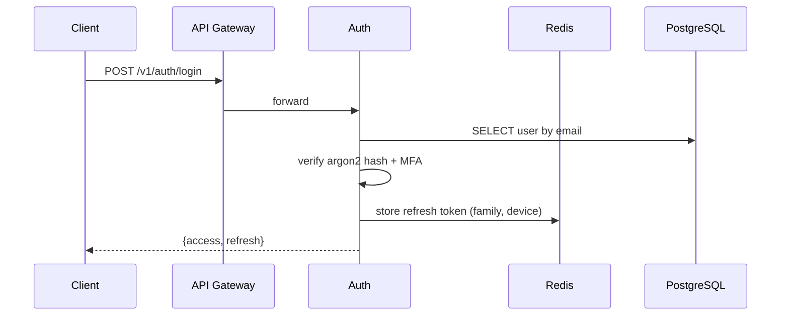

## 21.2 Movie Search
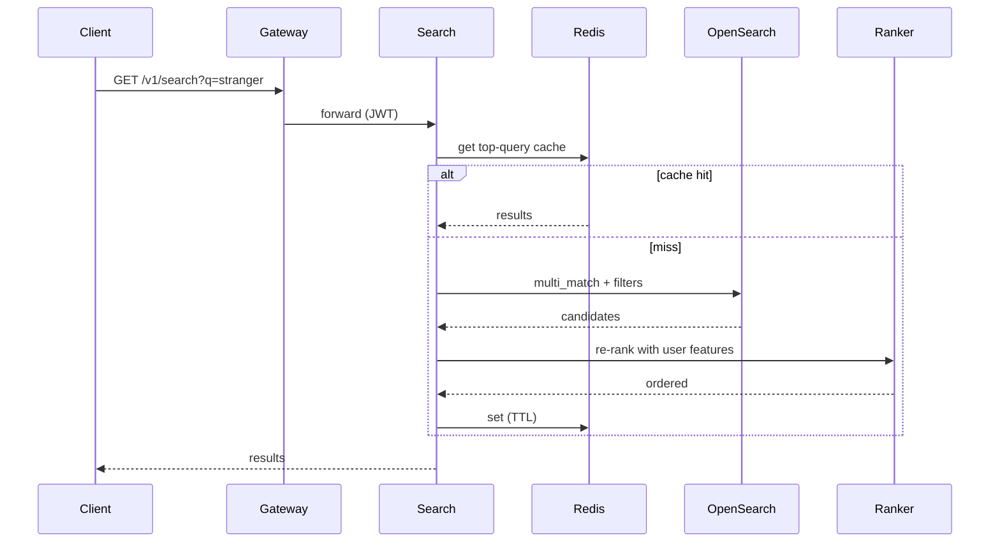

## 21.3 Play Movie
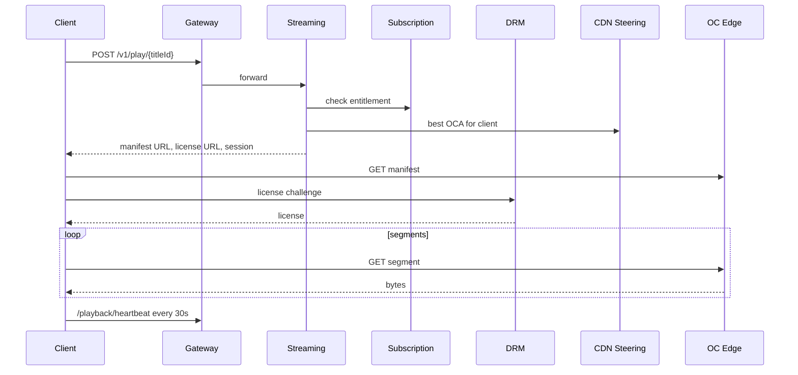

## 21.4 Upload Video
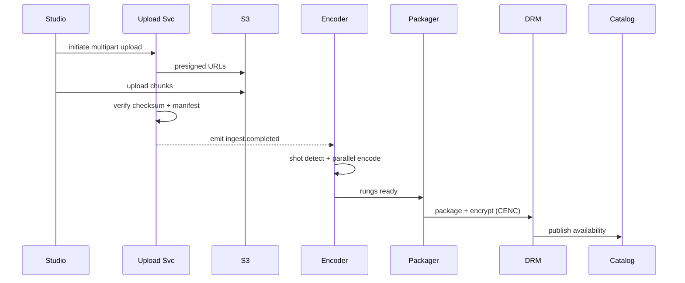

## 21.5 Recommendation Generation
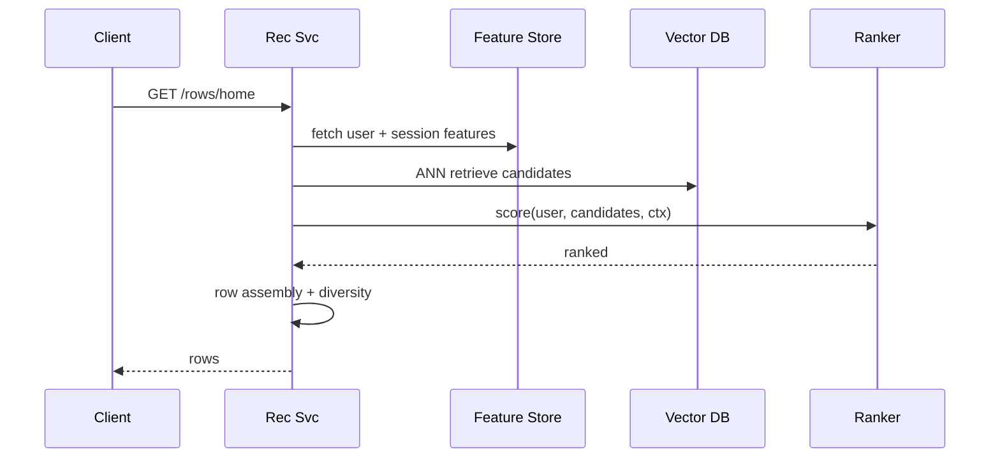

## 21.6 Subscription Purchase
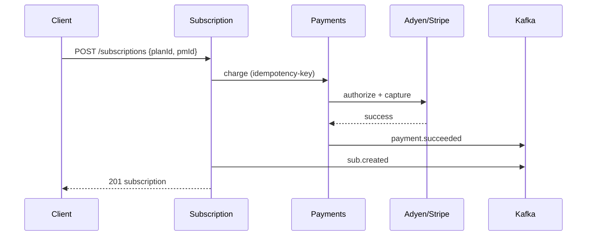

## 21.7 Continue Watching
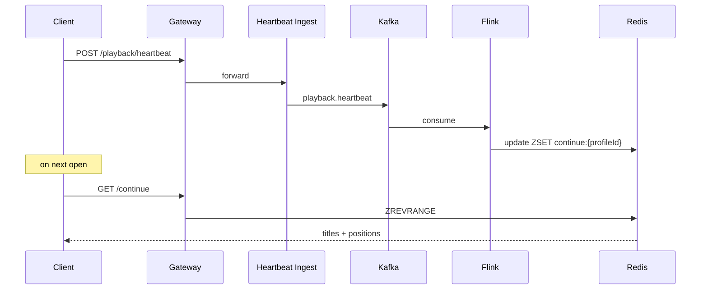

---

# PART 22 — UML Diagrams

## 22.1 Use Case
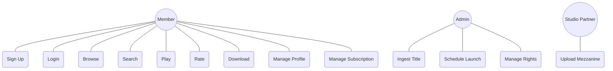

## 22.2 Class Diagram (core domain)
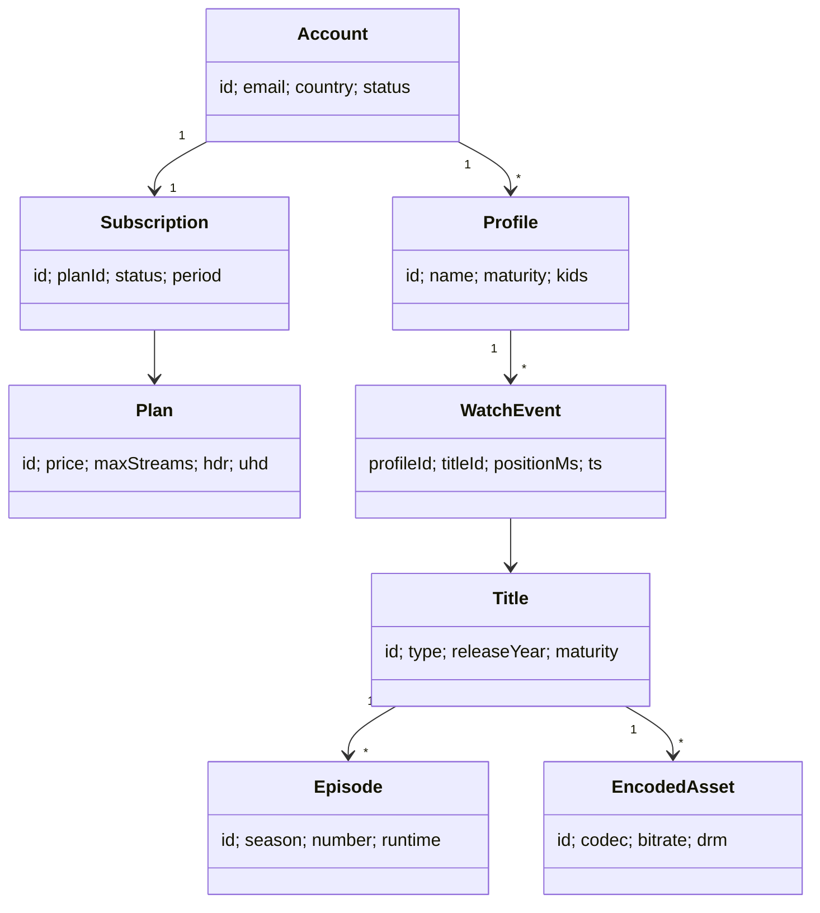

## 22.3 Activity — Play
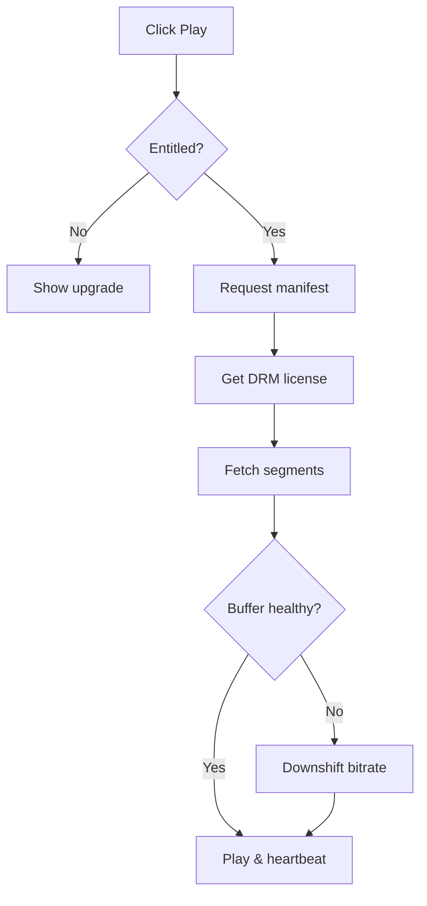

## 22.4 State — Playback Session
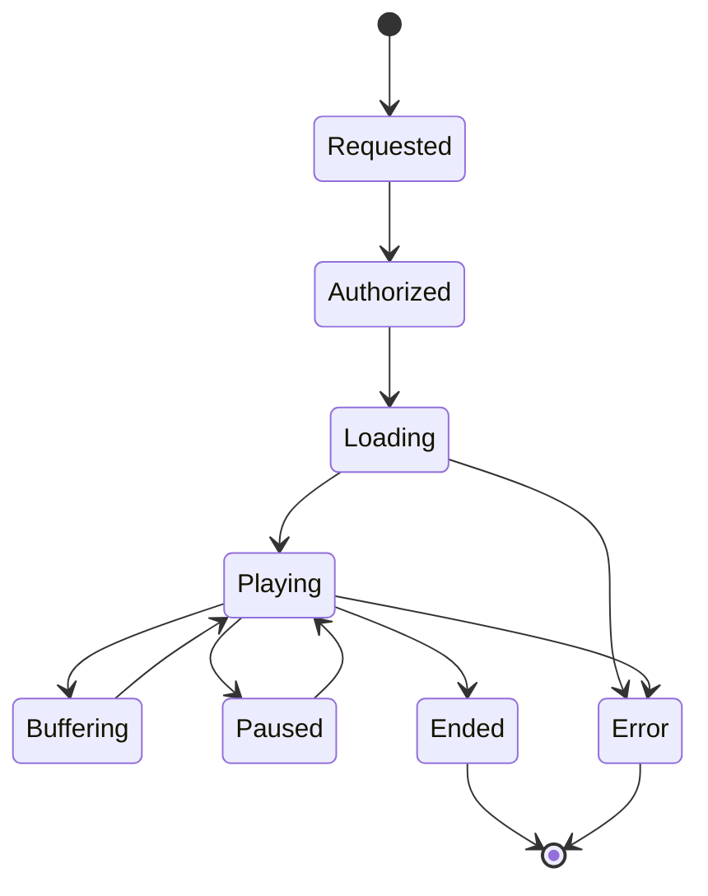

## 22.5 Deployment
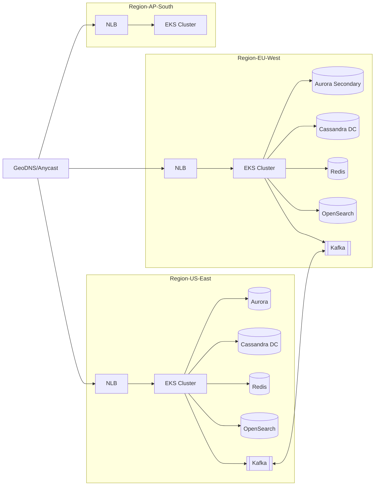

## 22.6 Component
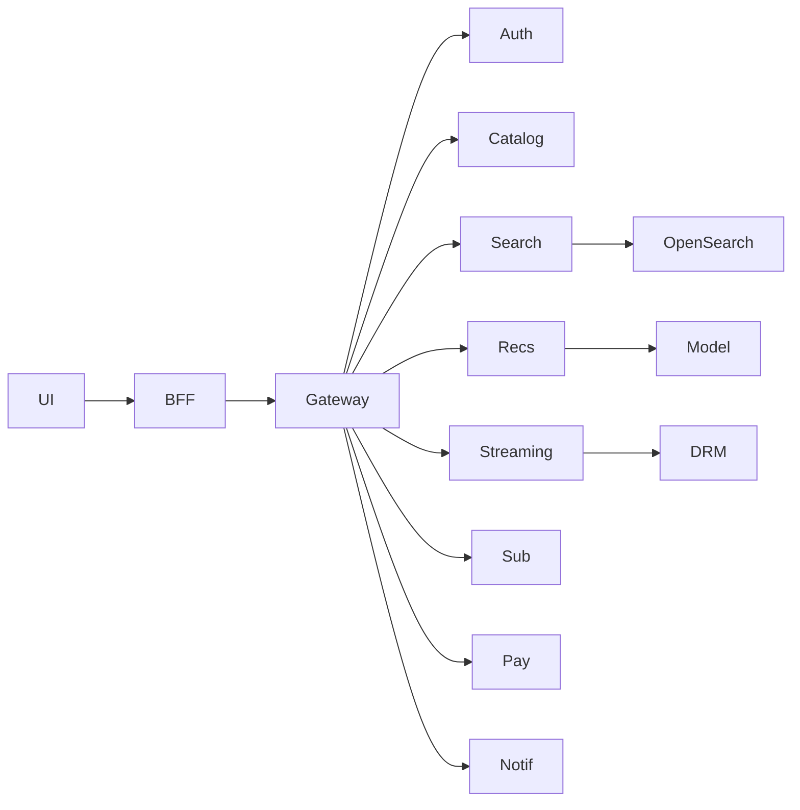

## 22.7 Package
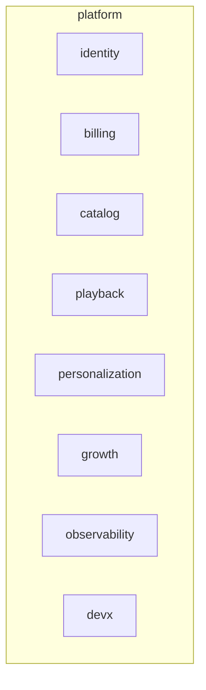

## 22.8 Sequence — see Part 21.

---

# PART 23 — Data Flow Diagrams

## 23.1 Context (Level 0)
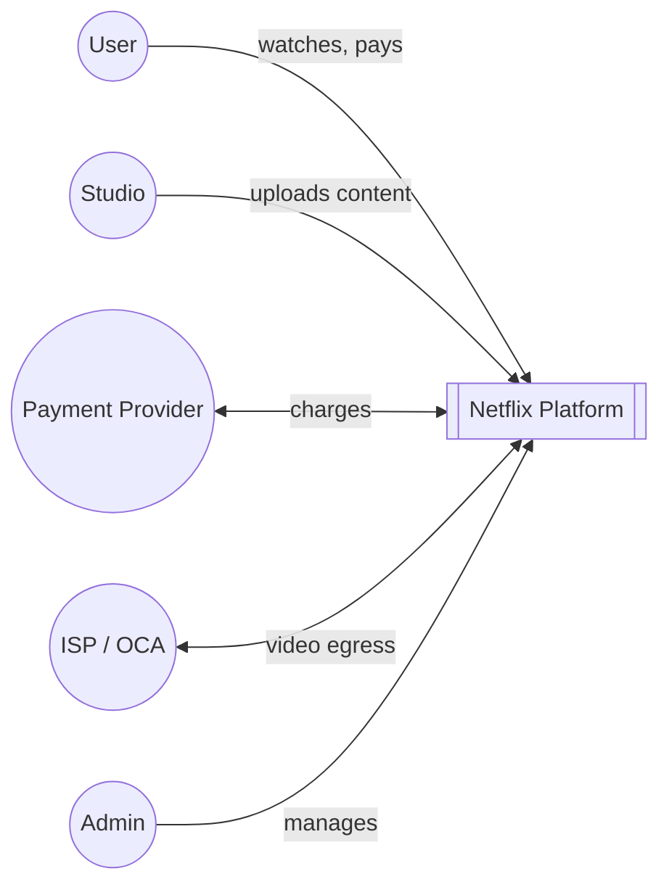

## 23.2 Level 1
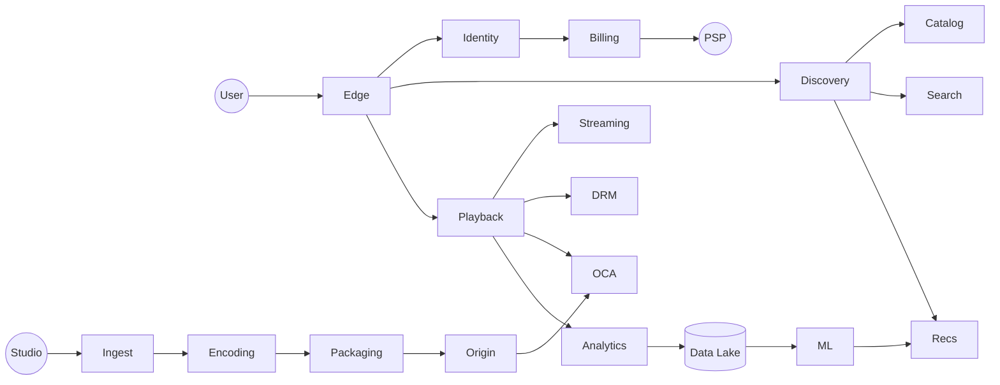

## 23.3 Level 2 — Playback
```mermaid
flowchart LR
  Client --> Gateway --> Streaming
  Streaming --> Entitlement --> Subscription --> AuroraSub[(Aurora)]
  Streaming --> Steering --> OCAHealth[(Redis)]
  Streaming --> ManifestBuilder --> S3
  Client --> DRM --> KMS
  Client --> OCA --> ISP
  Client --> Heartbeat --> Kafka --> Flink --> Cassandra & Redis
```

## 23.4 Level 2 — Recommendations
```mermaid
flowchart LR
  Events --> Kafka --> Flink --> FeatureStore
  Kafka --> Iceberg --> Spark --> ModelRegistry --> Serving
  Serving --> RecService --> Client
  FeatureStore --> Serving
  VectorDB --> RecService
```

---

# PART 24 — Network Architecture

- **DNS**: Route53 + geo-routing + latency-based; anycast for API.
- **Edge**: CloudFront/Fastly + WAF + Shield for API; OCAs for video.
- **VPC per region**: /16.
  - **Public subnets**: NLB, NAT, bastion.
  - **Private app subnets**: EKS nodes.
  - **Private data subnets**: Aurora, Cassandra, Redis, OpenSearch, Kafka.
- **NAT Gateways** per AZ for outbound.
- **Transit Gateway** for inter-VPC & DX to on-prem/DC.
- **PrivateLink** to PSPs and SaaS.
- **Service Mesh**: Istio with mTLS + AuthZ policies.
- **Segmentation**: strict SGs; NACLs; PCI VPC isolated.

```mermaid
flowchart TB
  Internet--> R53[Route53 GeoDNS]
  R53 --> CF[CloudFront + WAF]
  CF --> NLB
  NLB --> APIGW[Envoy Ingress]
  APIGW --> Mesh[Service Mesh]
  Mesh --> Services
  Services --> DBs[(Aurora / Cassandra / DDB / Redis / OpenSearch)]
  Services --> Kafka
  Services --> S3
  R53 -.video.-> OCA[Open Connect Edge]
```

---

# PART 25 — Technology Stack

| Layer | Choice | Why |
|---|---|---|
| Web | React + TypeScript, Next-style SSR/streaming | Ecosystem, SSR, SEO for marketing |
| Mobile | Swift (iOS), Kotlin (Android) | Native perf, HW-backed DRM |
| TV/Console | Native SDKs + Lightning/HTML5 | Broad device support |
| Backend | Java (Spring Boot / Micronaut), Kotlin, Go, Python (ML) | JVM ecosystem, Netflix legacy strength; Go for latency-sensitive; Python for ML |
| RPC | gRPC internal, REST/GraphQL edge | Perf + interop |
| API Gateway | Envoy + custom (Zuul-like) | Battle-tested, xDS |
| Service Mesh | Istio / Linkerd | mTLS, traffic mgmt |
| Orchestration | Kubernetes (EKS) | Standard, elastic |
| Queue | Apache Kafka (MSK) | Throughput + ordering |
| Stream Processing | Apache Flink | Exactly-once, low latency |
| Batch | Apache Spark on K8s | Scale, mature |
| Relational DB | Aurora PostgreSQL Global | ACID + multi-region |
| Wide-column | Apache Cassandra | Multi-DC writes |
| KV | DynamoDB | Managed, global |
| Cache | Redis Cluster + EVCache | Ms + memcached fanout |
| Search | OpenSearch | Full text + KNN |
| Vector | Milvus / OpenSearch-KNN | ANN at scale |
| OLAP | ClickHouse / Druid | Real-time analytics |
| Data Lake | S3 + Apache Iceberg | Cheap, schema-evolvable |
| Warehouse | Snowflake / BigQuery | SQL analytics |
| ML | PyTorch, Ray, MLflow, Feast, Triton/KServe | Modern stack |
| CDN | Open Connect + CloudFront + Fastly | Cost + reach + failover |
| Video | Shaka Packager, FFmpeg, AV1/HEVC/H.264 encoders | Standards, quality |
| DRM | Widevine, FairPlay, PlayReady | Studio mandate |
| IaC | Terraform + Crossplane | Multi-cloud |
| CI/CD | GitHub Actions + ArgoCD + Argo Rollouts + Helm | GitOps, canary |
| Observability | Prometheus, Grafana, OpenTelemetry, Tempo, Loki, PagerDuty | OSS + standard |
| Security | Vault, KMS, HSM, cosign, Trivy, OPA | Defense in depth |
| Feature Flags | LaunchDarkly-style / in-house | Safe rollout |
| Cloud | AWS primary, GCP secondary | Redundancy, negotiating leverage |

---

# PART 26 — Tradeoffs

- **Microservices vs Monolith**: chosen for org scale (Conway's law), independent deploys, tech heterogeneity. Cost: distributed complexity, need mesh + tracing + platform team.
- **Kafka vs SQS/RabbitMQ**: Kafka wins for high-throughput, replayable log with ordering per key; RMQ better for complex routing, SQS for simple managed FIFO but limited throughput.
- **Redis**: sub-ms hot data, atomic ops, pub/sub; downside memory cost + persistence tradeoff.
- **CDN**: absolute necessity for 225 Tbps peak; own CDN (Open Connect) cuts transit cost and gives QoE control; cloud CDN for burst/overflow.
- **NoSQL**: Cassandra/DDB scale writes horizontally and multi-region; give up joins & strong consistency for speed and availability.
- **SQL**: correctness-first domains (money, identity) — Aurora provides HA + multi-AZ + PITR without sacrificing ACID.
- **CAP**: video streaming = AP (availability + partition tolerance). Payments = CP (consistency + partition tolerance).
- **Consistency Models**: strong for entitlement writes; read-your-writes for user actions via sticky session; eventual for recs and catalog.
- **Latency vs Cost**: closer/richer caches cost more but reduce infra + improve QoE — Netflix optimizes globally (Open Connect placement is a giant cost/latency tradeoff choice).

---

# PART 27 — 100 Netflix System Design Interview Questions with Answers

*(Answers are concise; each expandable in a real interview.)*

1. **How does Netflix stream to 45M concurrent users?** Own CDN (Open Connect) embedded in ISPs; ABR HLS/DASH over CMAF; multi-CDN steering; regional origins; efficient codecs (AV1/HEVC).
2. **Why does Netflix use a custom CDN?** Cost (transit), performance (in-ISP), control (pre-positioning, steering, QoE).
3. **What is Open Connect?** Netflix's purpose-built appliance program shipping cache servers to ISPs.
4. **How is a video encoded?** Mezzanine → shot detection → parallel per-shot encode into ladder (multiple bitrates/resolutions/codecs) → package into CMAF fMP4 → CENC encrypt → publish.
5. **Why per-title / per-shot encoding?** Different content needs different bitrates; saves 15–30% bandwidth at equal quality.
6. **HLS vs DASH?** Both ABR; HLS Apple-native, DASH open. CMAF unifies segments for both.
7. **What is adaptive bitrate streaming?** Player switches rungs based on bandwidth and buffer.
8. **How is DRM implemented?** Widevine (Android/Chrome), FairPlay (Apple), PlayReady (MS/Xbox) via CENC common key.
9. **How does Netflix handle 4K HDR?** HEVC/AV1 at 15 Mbps, Widevine L1 required, HDCP 2.2.
10. **How to pick the right CDN in real time?** Steering service uses BGP/IP → OCA mapping + health + utilization; client probes and switches on QoE degradation.
11. **How to guarantee low startup latency?** Small init segments, preconnect, prefetch manifest, warm license, low bitrate for first segments.
12. **How to reduce rebuffering?** BOLA ABR, large buffer target, downshift heuristics, aggressive CDN failover, QUIC.
13. **How does authentication work?** Password argon2id + optional MFA; JWT access + rotating refresh; JWKS at edge.
14. **How are concurrent stream limits enforced?** Redis atomic counter per subscription, TTL, deny on exceed.
15. **How is watch history stored?** Cassandra by (profileId, monthBucket), append-only.
16. **Why Cassandra over Postgres for history?** Massive write throughput, multi-DC masterless writes, time-series shape.
17. **How is Continue Watching computed?** Redis sorted set updated by Flink from `playback.heartbeat`; durable copy in DynamoDB.
18. **How does search work?** OpenSearch multi-field query + LTR re-rank + Redis top-query cache + autocomplete via edge-ngram.
19. **How do recommendations work?** Two-stage retrieve (ANN + CF + editorial) then rank via deep model; row assembly for diversity.
20. **What's the ML pipeline?** Events → Kafka → Flink (online features) & Iceberg (offline) → Spark/Ray training → MLflow registry → Triton serving.
21. **How to handle cold-start users?** Onboarding survey → seed embedding; heavy fallback to trending-in-country.
22. **How to handle cold-start titles?** Content-based embedding from metadata + trailer video/audio embeddings; exploration boost.
23. **How is A/B testing done?** Central experimentation service assigns buckets deterministically per user; metrics evaluated via causal-inference pipelines.
24. **What does the API gateway do?** TLS, authN, rate limit, routing, circuit breaker, request shaping.
25. **How is rate limiting implemented?** Token bucket in Redis per user+IP; sliding window log for critical endpoints.
26. **How to handle payments idempotently?** `Idempotency-Key` header stored in Redis with response; retries return same result.
27. **How are refunds processed?** Async; audit trail; reconciliation nightly with PSP.
28. **How to handle multi-region payments?** Regional PSP endpoints; primary region for user; failover with reconciliation.
29. **How to achieve 99.99% availability?** Multi-region active/active, redundancy per AZ, PDBs, canary deploys, chaos testing, quick DNS failover.
30. **What is chaos engineering?** Deliberately injecting failures (killing pods, adding latency, evacuating regions) to validate resilience.
31. **How is zero-downtime deploy done?** K8s rolling + PDB + readiness probes; canary via Argo Rollouts; blue/green for risky changes.
32. **How are DB migrations rolled out safely?** Expand-contract: additive schema first, dual-write, backfill, switch reads, drop old.
33. **What's the difference between active-active and active-passive?** A-A serves traffic in all regions; A-P has warm standbys.
34. **How to design for CAP?** Split by domain: strong consistency for money/identity; AP for streaming/catalog.
35. **What consistency does DynamoDB give?** Eventual by default; strong reads optional (cost + latency).
36. **How does Cassandra achieve high availability?** Peer-to-peer, tunable consistency (LOCAL_QUORUM), multi-DC replication.
37. **What is EVCache?** Netflix's memcached-based cross-AZ cache with client-side replication.
38. **Redis vs Memcached?** Redis richer (structures, persistence, pub/sub); Memcached simpler and lighter.
39. **How is search personalized?** LTR re-rank on top-k using user embedding features.
40. **How to prevent recommendation staleness?** Flink real-time features; hourly model refresh; per-request session features.
41. **How is trending computed?** Sliding-window counts by country/language; decayed popularity.
42. **How to handle DDoS?** WAF, Shield/Cloudflare, anycast absorbing, rate limits, bot mgmt, challenge pages.
43. **How is TLS terminated?** At edge (CloudFront/Envoy) with TLS 1.3, 0-RTT; mTLS internally.
44. **How to store secrets?** Vault / Secrets Manager with dynamic short-lived credentials; External Secrets Operator on K8s.
45. **How is PII protected?** Region residency, encryption at rest with KMS, field-level encryption for sensitive columns, access audit.
46. **How is GDPR compliance handled?** Data-subject workflow (access, delete), regional processing, DPA with vendors.
47. **How are logs centralized?** Fluent Bit → Kafka → OpenSearch (hot) + S3 (cold), with PII scrubbing at ingest.
48. **How is tracing done?** OpenTelemetry SDKs → OTLP → Tempo/Jaeger; W3C traceparent propagated across services.
49. **What SLOs apply?** Availability (99.99%), latency p95 targets per endpoint, error rates; error budgets guide deploy risk.
50. **How to handle a bad deploy?** Argo Rollouts auto-rollback on metric analysis; feature flag kill switch; DB migrations reversible.
51. **How is a new region added?** Terraform bootstraps VPC/EKS/data planes; Cassandra add-DC, Aurora add-secondary, DDB add-region; canary traffic then GSLB shift.
52. **How to shed load?** Backpressure with bounded queues; 503 + Retry-After; degrade to cached/editorial responses.
53. **How to protect DBs?** Connection pool caps; per-service credentials; query timeouts; slow-query monitor; read replicas.
54. **How is video encrypted?** CENC (AES-128 CTR) per segment; keys per title/rung, held in DRM KMS.
55. **How is a license issued?** Client sends challenge to license server, which checks entitlement + device + policy and returns license.
56. **How to prevent password stuffing?** Rate limits, device fingerprinting, credential-stuffing detection, MFA, breach-corpus check.
57. **How to send push notifications reliably?** Kafka topic, worker consumer, provider client with retries, DLQ, delivery receipts.
58. **How is Watch Together synced?** WebSocket rooms; leader clock; drift-based seek.
59. **How is live streaming done?** MediaLive encoder → LL-HLS/DASH → OCAs; DVR window; SCTE-35 for ad markers.
60. **How to insert ads?** SSAI stitching per session; frequency capping via user profile; brand safety via metadata.
61. **What's an edge-optimized manifest?** Manifest served from edge with 5s TTL + SWR; bitrate list tailored per device.
62. **How to handle a hot title launch?** Pre-positioning to OCAs off-peak; capacity reservation; ramp launch schedule per region.
63. **Why not stream from S3 directly?** Egress cost, no ISP proximity, poor QoE, no steering.
64. **How to store recommendations?** Precomputed rows per (profile, rowType) in DDB/Cassandra; TTL; re-computed on session.
65. **Which stores are strong-consistent?** Aurora (SQL), Redis single-master; DDB with strong-read flag.
66. **What is the read/write ratio?** ~100:1 on control plane; writes dominated by heartbeats — handled by Cassandra/Kafka.
67. **How to shard Kafka topics?** By entity key (`profileId`) for ordering; partitions sized for throughput headroom.
68. **What is exactly-once processing?** Idempotent producer + transactions across source/sink; consumer stores offset transactionally.
69. **How to handle poison messages?** Retry with backoff, then DLQ with replay tooling.
70. **How is Kafka replicated cross-region?** MirrorMaker 2 with topic renaming; consumers subscribe locally.
71. **How to handle schema evolution?** Confluent Schema Registry with Avro/Protobuf; compatibility rules.
72. **How to prevent thundering herds?** Single-flight in cache layer; jittered TTL; SWR at CDN.
73. **How to cache home page?** Per profile, TTL 15 min, invalidated on watch event that changes taste; row placeholder + client hydration.
74. **How does the Recommendation Service scale?** Stateless HPA; GPU pool for ranker with request batching; DDB read-hot rows cached in Redis.
75. **How to compute similar titles?** Item-item CF + content embedding + co-view; served from precomputed ANN.
76. **What if the ML model fails?** Fall back to precomputed rows, then editorial defaults; circuit breaker.
77. **How to test recommendations?** Interleaving experiments + A/B on CTR/take-rate/hours viewed.
78. **How is fraud detected?** Sift/Kount + in-house rules on login, payments, credential sharing.
79. **How to detect password sharing?** Session/device graph across households; heuristics on IP + geo + device patterns.
80. **How is signup flow protected from bots?** CAPTCHA, email verification, rate limits, IP reputation, JS challenges.
81. **How is watch progress not lost on crash?** Heartbeat every 30s + local buffer + periodic snapshot to server; on resume, take max(server, local).
82. **How to design a fault-tolerant playback session token?** Signed JWT with short TTL, revocation via allowlist for premium (5m TTL).
83. **How to prevent hotlink of videos?** Signed URLs with short TTL scoped to session/device.
84. **How is CDN cache purged if needed?** Versioned URLs preferred; else key-purge fanout to OCAs via secure control plane.
85. **How is HTTPS certificate managed?** ACM/CertManager auto-renew; wildcard for domains; per-service SPIFFE identities for mTLS.
86. **How to route users to nearest region?** Route53 latency-based + geo-DNS; anycast for API entry.
87. **How to handle region evacuation?** Drain traffic via GSLB weights; failover data plane already replicated; run drills.
88. **What's the DR strategy?** Multi-region active/active; RPO ≤ 60s; RTO ≤ 5 min; runbook + quarterly drills.
89. **How to handle a Kafka outage?** Local retry buffer at producer; degrade non-critical events; DR cluster.
90. **What if Cassandra loses a node?** Auto stream data from replicas; hinted handoff during; alerts on RF violations.
91. **How to migrate a service DB?** Dual-write, backfill, verify parity, switch reads, decommission old.
92. **How to add a new codec (AV1)?** Encode alongside; gate by device capability; measure QoE + savings; ramp.
93. **What are QoE metrics?** VSF, start-up time, rebuffer ratio, average bitrate, error rate.
94. **How is autoscaling tuned?** HPA on RPS + latency; predictive scaling based on daily curves; pre-warm before prime time.
95. **How is cost tracked?** Tagging + FinOps dashboards; per-team budgets; anomaly alerts.
96. **Why not fully serverless?** Cold-start latency and cost at Netflix scale; used selectively (edge functions, glue).
97. **Why not one giant SQL DB?** Doesn't scale writes; single failure domain; multi-region latency; different data shapes.
98. **How to keep search near-real-time on new titles?** Catalog events → indexer → OpenSearch bulk within seconds; alias flip after reindex.
99. **How to A/B test infra changes?** Canary + shadow traffic; compare golden signals; auto-rollback on regression.
100. **What would you change if starting today?** Bet on QUIC/HTTP3 first-class, AV1-default, more edge compute (WASM personalization), lean into stateful stream processing (Flink) for user-facing features, aggressive multi-cloud abstraction.

---

# PART 28 — Final Architecture Diagram

```mermaid
flowchart LR
  subgraph Clients
    W[Web]
    Mi[iOS]
    Ma[Android]
    TV[Smart TV]
    G[Console]
  end

  Clients --> R53[Route53 GeoDNS]
  R53 --> WAF[CloudFront + WAF + Shield]
  WAF --> GW[Envoy API Gateway]

  subgraph Region[Region: Active-Active x N]
    GW --> Mesh[Service Mesh Istio]
    Mesh --> Auth
    Mesh --> User
    Mesh --> Profile
    Mesh --> Sub[Subscription]
    Mesh --> Pay[Payments]
    Mesh --> Catalog
    Mesh --> Search
    Mesh --> Rec[Recommendations]
    Mesh --> History[Watch History]
    Mesh --> CW[Continue Watching]
    Mesh --> WL[Watchlist]
    Mesh --> Str[Streaming/Manifest]
    Mesh --> Lic[DRM License]
    Mesh --> Notif[Notifications]
    Mesh --> Ads
    Mesh --> Exp[Experimentation]

    Auth --> PG[(Aurora PG)]
    User --> PG
    Sub --> PG
    Pay --> PG_PCI[(Aurora PCI)]
    Catalog --> Cass[(Cassandra)]
    Search --> OS[(OpenSearch)]
    Rec --> DDB[(DynamoDB)]
    Rec --> VDB[(Vector DB)]
    History --> Cass
    CW --> Redis[(Redis/EVCache)]
    WL --> DDB
    Str --> Redis
    Lic --> HSM[(HSM/KMS)]

    Str --> Steering[CDN Steering]
    Steering --> OCA[Open Connect Edge]

    Auth & Sub & Pay & Str & Notif --> Kafka[[Kafka]]
    Kafka --> Flink[Flink Streaming]
    Kafka --> Iceberg[(S3 + Iceberg)]
    Iceberg --> Spark[Spark/Ray Training]
    Spark --> MLReg[MLflow Registry]
    MLReg --> Triton[Triton/KServe]
    Triton --> Rec
    Flink --> FS[(Feature Store)]
    FS --> Triton
  end

  subgraph Video[Video Pipeline]
    Studio((Studio)) --> Ingest --> S3M[(S3 Mezzanine)]
    S3M --> Encoders[Encoder Farm GPU/Spot]
    Encoders --> Packager[Shaka Packager CMAF]
    Packager --> DRMpk[DRM Packaging CENC]
    DRMpk --> Origin[(S3 Delivered Assets)]
    Origin --> OCA
  end

  subgraph Observability
    Metrics[Prometheus + Atlas]
    Logs[Fluent Bit -> OpenSearch/S3]
    Traces[OTel -> Tempo]
    Alerts[Alertmanager -> PagerDuty]
  end

  Mesh -.-> Metrics
  Mesh -.-> Logs
  Mesh -.-> Traces
  Alerts --> OnCall((On-Call))

  subgraph DevOps
    GH[GitHub Actions] --> Argo[ArgoCD]
    Argo --> K8s[EKS Clusters]
    TF[Terraform] --> Cloud
    Vault --> K8s
  end
```

---

**End of Document.**

